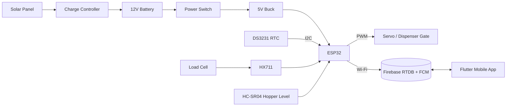

# Methodology Analysis — Smart Mobile-Based Solar-Powered Chicken Feeding System

Source: `Methodology.docx` (Chapter II). This note converts the paper into engineering requirements.

## 1. What the system must do

| # | Requirement (from methodology) | Implemented by |
|---|---|---|
| F1 | Feed on a programmed schedule | DS3231 RTC → ESP32 |
| F2 | Dispense an exact **target weight**, not a timed amount | Servo gate + load cell/HX711 closed loop |
| F3 | Stop automatically when target reached (anti-overfeeding) | Firmware loop compares weight vs target |
| F4 | Monitor remaining feed in hopper | HC-SR04 ultrasonic (distance ↑ = level ↓) |
| F5 | Run on solar, survive night / cloudy days | Panel → charge controller → battery → switch → 5V buck |
| F6 | Remote monitoring: feeding status, feed weight, feed level, battery, next schedule | ESP32 Wi-Fi → Firebase RTDB → Flutter app |
| F7 | Real-time alerts: feeding completed, feed dispensed, low feed, low battery, system error | Firebase + FCM push |
| F8 | Manual feeding from the app | App writes command → ESP32 listens |

## 2. Architecture (Figure 1)

## 3. Evaluation criteria the build must support

The prototype is evaluated on three axes, so the firmware/app should **log the data needed**:

- **System Performance** — dispensing accuracy (target vs actual grams, verified with a digital scale), feeding response time (schedule → gate open), notification response time (event → phone), solar energy efficiency (battery voltage over time).
- **System Quality** — automated feeding functionality, operational reliability, mechanical durability, electrical/operational safety.
- **User Acceptability** — usefulness, ease of use, convenience, satisfaction (questionnaire, Likert scale).

➡ Plan: firmware stores per-feeding records `{scheduledAt, startedAt, finishedAt, targetG, actualG, ok}` and alert timestamps in Firebase so accuracy and response-time tables can be exported directly for Chapter IV.

## 4. Gaps / issues spotted in the document

1. **Load cell placement**: it sits "below the dispensing outlet" on a weighing tray. Chickens eating from that tray will change the reading — the tray must be tared before each feeding (done in firmware) and ideally separate from the eating trough.
2. **HC-SR04 is 5V logic** — ECHO needs a voltage divider to the ESP32's 3.3V input. A waterproof JSN-SR04T is better for dusty coops.
3. **Battery monitoring** is required for "low battery" alerts but no voltage sensor is listed in the parts table — add a resistor divider (or INA219) to an ADC pin.
4. **Servo torque**: an SG90 will jam on feed pellets; use an MG996R (metal gear) or consider an auger/DC motor.
5. **Solar sizing** is not specified (panel W, battery Ah). Needs a power budget (ESP32 Wi-Fi ≈ 80–240 mA) for the "Solar Energy Efficiency" metric.
6. **Offline behaviour**: if Wi-Fi drops, schedules must still run from the RTC and alerts should queue.
7. Typo in parts table: "Solar Pannel" → "Solar Panel"; Materials list omits the load cell, HX711, ultrasonic sensor and buck converter that appear later.

## 5. Suggested Bill of Materials

| Part | Suggested model |
|---|---|
| Microcontroller | ESP32 DevKit V1 (WROOM-32) |
| RTC | DS3231 module (with CR2032) |
| Load cell + amp | 1–5 kg bar load cell + HX711 |
| Level sensor | HC-SR04 (or JSN-SR04T) |
| Servo | MG996R |
| Solar | 20–30 W 12V panel + PWM/MPPT controller |
| Battery | 12V 7Ah SLA (or 3S Li-ion w/ BMS) |
| Regulator | LM2596 / MP1584 buck to 5V |
| Battery sense | 40k/10k divider to GPIO34 |
